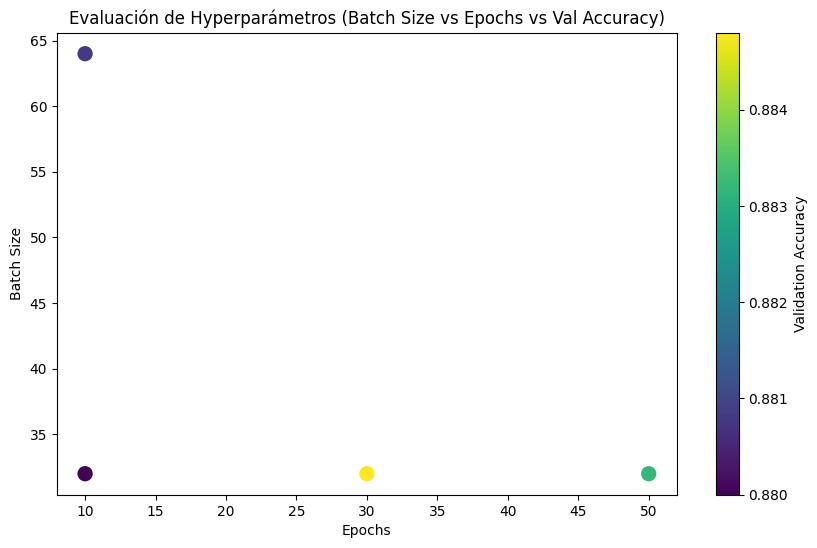

# Cédula de Supervisión

Autores:
- Marcela Cotí Pac
- Diego Sarceño


## Configuración
Se recomienda crear un entorno virtual e instalar el ***requirements.txt*** para instalar los paquetes y sus dependencias.

```
$ python -m venv <nombre_del_entorno>
```

Esto se recomienda hacerlo fuera del proyecto, para activarlo es sencillo:
```
$ C:\ruta\al\entorno\Scripts\activate
```

Además, es útil tener el entorno virtual en el kernel de JupyterNotebook. Por ende es necesario realizar los siguiente:
```
python -m ipykernel install --user --name nombre_del_entorno --display-name "Python <nombre_del_entorno>"
```

Instalar el ***requirements.txt***:
```
$ pip install -r requirements.txt
```

Además, para trabajar con la librería de *nltk* (Natural Language Toolkit) es necesario instalar unas pequeñas ayudas (***Corpus***, los cuales son conjuntos de datos, modelos o listas que se utilizan para el procesamiento de lenguaje natural), las cuales solo deben de realizarse la primera vez:
```
directorio = 'c:\\ruta\\al\\entorno\\lib\\nltk_data'

# Agrega la ruta de descarga a la lista de rutas de NLTK
nltk.data.path.append(directorio)

# Descargar el recurso 'punkt', 'punkt_tab', 'stopwords'
nltk.download('punkt', download_dir=directorio)
nltk.download('punkt_tab', download_dir=directorio)
nltk.download('stopwords', download_dir=directorio)
```


Estos que se instalaron tienen las siguientes características y usos:
1. **punkt:**
   - Descripción: Es un modelo de tokenización que permite dividir un texto en oraciones o palabras. Se basa en un algoritmo de aprendizaje automático que identifica los límites de las oraciones.
   - Uso: Generalmente se utiliza para preprocesar texto antes de análisis más profundos, como el análisis de sentimiento o la extracción de características.
1. **punkt_tab:**
   - Descripción: Similar a 'punkt', pero diseñado para manejar tabulaciones y formatos específicos de texto que pueden incluir caracteres especiales.
   - Uso: Utilizado en casos donde el texto tiene un formato tabular o donde los delimitadores son diferentes a los típicos espacios y puntos.
2. **stopwords:**
   - Descripción: Es una lista de palabras comunes (como "y", "el", "de", etc.) que generalmente se eliminan de los textos porque no aportan valor semántico significativo en muchas aplicaciones de procesamiento de lenguaje natural.
   - Uso: Se utiliza en el preprocesamiento de textos para mejorar la calidad de los modelos de análisis, eliminando palabras que pueden introducir ruido en el análisis.


Para la parte de *lematización* instala spacy (se encuentra en el requirements), pero es necesario agregar el modelo en español, este se instala de la siguiente manera:
```
$ python -m spacy download es_core_news_sm
```

## En este Repositorio

> 💬 **NOTE:**
Luego del preprocesamiento de los datos, es necesario realizar un [análisis exploratorio](EDA.md) para tener una visión más clara sobre con qué estamos trabajando.

### Estructura del Repositorio

```markdown
C:\Users\daalvarado\OneDrive - ine.gob.gt (1)\Documentos\diego_sarceño\cedulasupervision/
├── .env
├── paquetes.txt
├── requirements.txt
├── supervision/
    ├── data/
        ├── IMDB_spanish.csv
        ├── imdb_espaniol_mod.csv
        ├── netflix/
            └── film_reviews_result.csv
    ├── main.ipynb
    ├── main.py
    ├── misc/
        ├── evaluacion.png
        ├── lib_config.txt
        └── queries_info_sup_certificate.sql
    ├── model/
        ├── csModel.h5
        ├── csModel.weights.h5
        ├── cs_tokenizer.json
        ├── maxlen
        ├── my_model.h5
        └── my_model.keras
    ├── notebooks/
        ├── Polars_v_Pandas.ipynb
        ├── amazon_books.ipynb
        ├── amazon_reviews.ipynb
        ├── eda.ipynb
        ├── netflix.ipynb
        ├── text_manipulation.ipynb
        └── translaltor.ipynb
    ├── src/
        ├── __init__.py
        ├── data_preprocessing.py
        ├── model.py
        └── utils.py
    └── test/
        └── model_tests.ipynb
└── upload_gitlab_rep.bat
```


## Documentación

### Sentiment Analysis:
El ***análisis de sentimientos*** es una técnica dentro de la minería de texto y el procesamiento de lenguaje natural (NLP) que tiene como objetivo identificar y clasificar las emociones o actitudes expresadas en un texto. Este análisis permite comprender si el tono del texto es **positivo, negativo o neutral**, y a veces incluso captar las emociones más específicas como alegría, enojo o tristeza.

Este se basa en el uso de algorimos y modelos de machine learning o deep learning, que son entrenados con grandes cantidades de datos para reconocer patrones ligüisticos y asociarlos con distintos sentimientos. También puede usar diccionarios de palabras con sentimientos asociados, o bien modelos estadísticos avanzados que consideran el contexto para una interpretación más clara.


##### Objetivos principales del Análisis de Sentimientos

1. **Clasificación de sentimientos**: Identificar el tono general del texto, ya sea positivo, negativo o neutral.
2. **Comprensión de emociones específicas**: En algunos casos, identificar emociones particulares como miedo, sorpresa o enojo.
3. **Análisis de tendencias**: Ayudar a empresas y organizaciones a detectar patrones y tendencias en las opiniones de sus usuarios o clientes.
4. **Mejora en la toma de decisiones**: Facilitar que las empresas ajusten sus estrategias de marketing, servicio al cliente o desarrollo de productos según el feedback emocional de los usuarios.

#### Implementación.
##### - Limpieza y Preprocesamiento de Datos
De los datasets descargados mostrados posteriormente, solamente se utilizó el primero mencionado, esto debido a que está en español, tiene una buena cantidad de datos y es bastante simple su forma de mostrar los datos. Con esto se realizó el preprocesamiento y limpieza de los datos. 

En cuanto a la limpieza no hubo mucho que hacer, no había irregularidades ni inconsistencias en los datos, así como valores nulos. Sin embargo, en el preprocesamiento se realizaron diferentes pasos:

1. Se eliminaron las etiquetas html que pudiera tener. Algunos datasets las traen por la forma en la que son construidos y de donde se extrae la información; en el caso de nuestro dataset fue más por precaución que por otra cosa.
2. Se eliminan los caracteres especiales ya que estos terminan no aportando nada al texto.
3. Quitamos los espacios extra, tanto al inicio, como dentro del texto, como al final.
4. Eliminamos las llamadas *stopwords* (de, el, y, es, etc.) que tampoco aportan nada al contexto del mismo.
5. Se realiza la *lematización* del texto, la cual consiste en llevar las palabras a su forma base, como los verbos a infinitivo.

Luego de realizar esto, ya nos trasladamos a la parte de crear y evaluar el modelo, separando la data.


##### - Modelo
Se separan los datos en 2 conjuntos, conjunto de entrenamiento y conjunto de pruebas, que a su vez se divide en 2 conjuntos, el de evaluación del modelo y el de validación del modelo. Ya con estos conjuntos hechos, procedemos a definir la arquitectura de nuestra red.

```
model = Sequential([
    Embedding(max_features, embed_size),   # Capa de Embedding: representa palabras en dimensiones vectoriales
    LSTM(60, return_sequences=True),       # Capa LSTM: modelo de secuencia que aprende patrones temporales y contextuales
    GlobalMaxPool1D(),                     # Reducción de dimensionalidad manteniendo valores máximos de las secuencias
    Dense(50, activation='relu'),          # Capa Densa: añade capacidad de aprendizaje no lineal
    Dropout(0.1),                          # Dropout: evita el sobreajuste desactivando neuronas de forma aleatoria
    Dense(2, activation='sigmoid')         # Capa de salida: activación sigmoide para clasificar entre dos clases (positivo y negativo)
])
```

Explicando cada capa:
- Embedding: Su función es similar a la de Word2Vec, que genera un vector de características para cada palabra en el texto. En donde `max_features` es el tamaño de vocabulario y `embed_size` es la dimensionalidad del embeding (en este caso 128 dimensiones).
- LSTM (Long Short-Term Memory): Las LSTMs son redes neuronales recurrentes (RNN) especializadas para aprender patrones secuenciales. Capturan relaciones contextuales entre palabras de la reseña, lo cual es muy útil para entender el sentimiento en función de la estructura y contexto de las frases. Esta, en concreto, tiene 60 unidades y el parámetro `return_sequences=True` permite que la capa devuelva la secuencia completa, no solo la última salida.
- GlobalMaxPool1D: Esta aplica una operación de max pooling en la secuencia, tomando el valor máximo de cada dimensión. Esto reduce la secuencia de salida de LSTM a una sola capa densa y evita un crecimiento excesivo en el número de parámetros.
- Dense (50 unidades): Es una capa densa con 50 neuronas y activación `relu`. Añade capacidad de apredizaje no lineal.
- Dropout (10%): Ayuda a evitar el sobreajuste al apagar aleatoriamente el 10% de las neuronas durante el entrenamiento.
- Output (Sigmoid, 2 clases): La capa de salida usa una activación sigmoid y devuelve dos valores, uno para cada clase (positivo y  negativo). Esto es adecuado para la clasificación binaria, donde se interpretan los valroes como probabilidades para cada clase.

Compilando el modelo: `model.compile(loss='sparse_categorical_crossentropy', optimizer='adam', metrics=['accuracy'])
`
1. `loss='sparse_categorical_crossentropy'`: 
   `sparse_categorical_crossentropy` es una función de pérdida utilizada para problemas de clasificación en múltiples clases (multiclase). Este tipo de pérdida es adecuado cuando las etiquetas de clase están en forma de enteros (por ejemplo, 0 y 1 para binario, o 0, 1, 2, ... para varias clases).
   La "sparsidad" significa que las etiquetas no están en formato de "one-hot encoding" (es decir, no están en un vector con ceros y un uno en la posición correspondiente a la clase); simplemente son enteros representando las clases. Esto simplifica el procesamiento y es especialmente útil cuando tienes muchas clases o un gran volumen de datos, ya que reduce el tamaño del tensor de etiquetas.
2. `optimizer='adam'`: 
   `adam` es un optimizador popular que combina las ventajas de dos métodos de optimización: `AdaGrad` y `RMSProp`. Es adaptable y ajusta automáticamente la tasa de aprendizaje durante el entrenamiento, lo que generalmente permite una convergencia rápida y estable.
   Adam es ampliamente utilizado en deep learning, ya que funciona bien en una variedad de tareas y modelos.
3. `metrics=['accuracy']`: 
   Aquí estamos utilizando `accuracy` (precisión) como métrica para monitorear el rendimiento del modelo durante el entrenamiento y la validación. La precisión mide la proporción de predicciones correctas sobre el total de predicciones, lo cual es útil en problemas de clasificación.


Ajuste/entrenamiento del modelo:
```
early_stopping = EarlyStopping(monitor='val_loss', patience=3, restore_best_weights=True)
model.fit(X_train, Y_train, batch_size=batch_size, epochs=epochs, validation_data=(X_val, Y_val), callbacks=[early_stopping])

```

1. `X_train` y `Y_train`: 
   Estos son los datos de entrada y las etiquetas de entrenamiento, respectivamente.
   - `X_train` contiene las muestras de entrada (en este caso, embeddings de reseñas o secuencias de palabras).
   - `Y_train` contiene las etiquetas de salida correspondientes (por ejemplo, 0 o 1 para análisis de sentimientos binario).
2. `batch_size=batch_size`: 
   `batch_size` es el número de muestras que se procesan antes de que el modelo actualice sus pesos.
   - Un tamaño de lote más pequeño puede hacer que el modelo actualice sus parámetros más frecuentemente, pero puede ser más lento y menos estable.
   - Valores típicos de `batch_size` son 16, 32, 64, etc. (es recomendable que sean potencias de 2 por eficiencia en GPU).
3. `epochs=epochs`: 
   `epochs` es el número de veces que el modelo verá el conjunto completo de datos de entrenamiento.
   - Cada época representa una pasada completa a través de todos los datos de entrenamiento.
   - Un mayor número de épocas permite que el modelo se ajuste mejor a los datos, aunque si se excede, puede sobreajustarse. 
   - Normalmente se establecen en un valor entre 10 y 100, dependiendo del tamaño del conjunto de datos y la complejidad del modelo.
4. `validation_data=(X_val, Y_val)`: 
   `validation_data` es una tupla que contiene los datos de validación (entradas y etiquetas) que se usan para evaluar el rendimiento del modelo después de cada época de entrenamiento.
   - Esto permite ver cómo se está comportando el modelo con datos que no ha visto antes, ayudando a monitorear si el modelo está sobreajustando.
   - Durante el entrenamiento, Keras calcula y muestra la pérdida y precisión (u otras métricas) en el conjunto de validación después de cada época.

##### - Rendimiento y elección de Hiperparámetros:
Dado que es necesario saber que hiperparámetros tomar para que la red se enetrene correctamente sin tener underfitting u overfitting. Para ello se iban a realizar varios entrenamientos con diferentes `batch_size` y `epochs` para determinar que combinación genera la mejor *accuracy*. Esto no se concluyó dado que el tiempo de entrenamiento es considerablemente alto. En el notebook [model_tests](supervision/notebooks/model_tests.ipynb) se pueden encontrar los resultados de 4 ejecuciones con su *accuracy*, tiempo de ejecución, ``batch_size`` y ``epochs``.





Lo ideal sería que en un servidor dejar corriendo el codigo de prueba para unos 10 a 12 casos diferentes para elegir de la mejor forma posible los hiperparámetros. Pero si el pronostico para las pruebas que realicé era de 12 horas, hacerlo con tiempo y sin apuros es lo ideal.

#### - Despliegue:
Al principio la idea era desplegar una API Rest para el uso del modelo en cualquier cantidad de programas, esto se puede realizar utilizando ``fastAPI``, la cual es una librería de python. Sin embargo, este despliegue se realizó de manera local. Esto con las mismas herramientas brindadas por las librerías de ``Tensorflow`` y ``Keras``. Esto se realiza de la siguiente forma:

1. **Método 1:** Guardando en formato ``.h5`` que es una de las formas más comunes se realiza los iguiente:
   ```
   # guarda el modelo completo
   modelo.save('nombre_del_modelo.h5')

   # o de esta forma
   keras.saving.save_model(model, 'nombre_del_modelo.keras')
   ```

   - El archivo `.h5` (HDF5) contiene toda la información necesaria para tu modelo:
     - La arquitectura
     - Los pesos
     - Las configuraciones de entrenamiento
     - El optimizador (si lo tienes configurado)
   - Es adecuado para la portabilidad y puede cargarse en cualquier entorno que tenga **Keras** y **TensorFlow**.
   - Tiene un tamaño moderado, dependiendo de la cantidad de pesos y la complejidad de tu modelo.
   
   Para cargar el modelo en un nuevo programa:
   ```
   from tensorflow.keras.models import load_model

   modelo = load_model('modelo_sentimiento.h5')
   ```
2. **Método 2:** Guardar el modelo en formato de TensorFlow SavedModel. Este es el estándar preferido por TensorFlow, en especial cuando se desea deplegar modelos en producción o en otros entornos de tensorflow.

   ```
   # guardar en formato SavedModel
   modelo.save('nombre_del_modelo_tf', save_format='tf')
   ```
   - El modelo se guarda en una carpeta llamada `modelo_sentimiento_tf` (o el nombre que le des) que contiene subcarpetas y archivos necesarios para TensorFlow.
   - Este formato es muy flexible y puede utilizarse para hacer despliegues en **TensorFlow Serving** o **TensorFlow Lite**.
   - Permite contener varias versiones de un mismo modelo, lo cual es útil para actualizaciones sin interrupciones.
   - Contiene tanto los pesos como la arquitectura, al igual que el formato `.h5`, pero se adapta mejor a entornos avanzados y multiplataforma de TensorFlow.

   Y para cargar el modelo:
   ```
   # cargar desde un directorio en savemodel
   modelo = load_model('nombre_del_modelo_tf')
   ```
3. **Método 3:** Este método es el que menos me gusta, dado que es necesario conocer la arquitectura con la que fue creado el modelo y en caso que se desee mantener esa información privada, pues deja de ser viable el método. Pero, el guardar unicamente los pesos hace que el archivo pese mucho menos y sea mucho más fácil su despliegue en otros dispositivos.
   ```
   # Guardando los pesos
   modelo.save_weights('pesos_modelo.h5')
   ```
   - Contiene solo los pesos del modelo y no la arquitectura.
   - Es más liviano que guardar el modelo completo.
   - Para usarlo, necesitas reconstruir la arquitectura del modelo en el código antes de cargar los pesos.

   ```
   # Primero, define la arquitectura del modelo
   from tensorflow.keras.models import Sequential
   from tensorflow.keras.layers import Embedding, LSTM, Dense

   modelo = Sequential([
      #### ARQUITECTURA ####
   ])

   # Luego, cargar los pesos
   modelo.load_weights("pesos_sentimiento.h5")
   ```

| Formato       | Extensión | Contenido                               | Uso recomendado                              |
|---------------|-----------|-----------------------------------------|----------------------------------------------|
| .h5           | .h5       | Arquitectura + pesos + configuración    | Fácil para guardado local y uso en Keras.    |
| SavedModel    | Directorio| Arquitectura + pesos + metadatos en formato TF | Ideal para despliegue en TensorFlow Serving. |
| Pesos solo    | .h5       | Solo los pesos del modelo               | Para cargas personalizadas o experimentación. |


Además es necesario guardar el tokenizador. Esto porque es un pilar fundamental en el entrenamiento del modelo y si se le asignan tokens ya usados a palabras ya existentes en el tokenizador del modelo a una palabra de lo que sea que estemos utilizando, pues ya no tendra sentido hacer predicciones. Por ende, es necesario guardar los tokens utilizados. Esto se puede hacer en formato `.json` de la siguiente forma:
```
from tensorflow.keras.preprocessing.text import Tokenizer
import json

# Supongamos que este es el tokenizador que usaste para entrenar el modelo
tokenizer = Tokenizer(num_words=10000)
tokenizer.fit_on_texts(textos_de_entrenamiento)

# Guardar el tokenizador en un archivo JSON
with open("tokenizer.json", "w") as f:
    json.dump(tokenizer.to_json(), f)
```

Y para cargar dicho tokenizador, se tiene lo siguiente:

```
from tensorflow.keras.preprocessing.text import tokenizer_from_json

# Cargar el tokenizador desde el archivo JSON
with open("tokenizer.json") as f:
    data = json.load(f)
    tokenizer = tokenizer_from_json(data)
```
Como se ve en el código del modelo, es necesario transformar estas palabras a ``pad_sequences``, lo cual requiere de una longitud dada, es **INDISPENSABLE** conocer este valor de longitud y utilizarlo para los nuevos textos, dado que sino es así, el modelo no podrá procesarlo.

- **Consistencia del preprocesamiento**: Asegúrate de que el `maxlen` de `pad_sequences` coincida con el utilizado en el entrenamiento del modelo. De lo contrario, el modelo puede no interpretar correctamente las entradas. Esto se puede importar del archivo llamado *`maxlen`* en la carpeta de *model*.
- **Tamaño del vocabulario**: Asegúrate de usar el mismo número de palabras (`num_words` en `Tokenizer`) en entrenamiento e inferencia. Esto afecta a cómo se indexan y seleccionan las palabras más frecuentes.
- **Preprocesamiento adicional**: Si aplicaste otras transformaciones al texto (como eliminación de puntuación o minúsculas), aplica los mismos pasos antes de tokenizar.

### Uso del Modelo
Para utilizar las funciones de limpieza de datos/texto se requiere que en el script/notebook se importe la carpeta *source* de la siguiente forma
```
from src import *
```
Esto accesa a las clases y métodos disponibles de la carpeta `src` en el archivo `__init__.py` dado que no es necesario que se tenga acceso a todo lo disponible en dicha carpeta. 

Con esto ya se puede realizar la importación del modelo de algunas de las formas mostradas anteriormente. La parte más importante y en la que quiero hacer más enfasis es la parte de tokenizar el texto:
```
# cambiando el texto a secuencias para su posterior 'embedding'
x_review_tests = tokenizer.texts_to_sequences(resenias_treated['review_es_mod'])
x_review_tests = sequence.pad_sequences(x_review_tests, maxlen=maxlen, padding='post')
```

Donde el `maxlen` es extraído del archivo que lleva su nombre en la carpeta *model*.


## Datasets

Los siguientes datasets fueron utilizados en este proyecto:

1. **Dataset 1: IMDB Dataset of 50K Movie Reviews (Spanish)**  
   - Este dataset fue creado usando "[IMDB Dataset of 50K Movie Reviews](https://www.kaggle.com/datasets/lakshmi25npathi/imdb-dataset-of-50k-movie-reviews)", que contiene 50k reseñas de películas con una clasificación positiva o negativa a cada una de ellas. Este contiene la data original y su traducción al español.  
   - Fuente: [Kaggle - IMDB Dataset of 50K Movie Reviews (Spanish)](https://www.kaggle.com/datasets/luisdiegofv97/imdb-dataset-of-50k-movie-reviews-spanish)

2. **Dataset 2: Amazon Reviews**  
   - Este dataset contiene 34,686,770 Reseñas de 6,643,669 usuarios sobre 2,441,053 productos, extraídas de "Standford Network Analysis Project (SNAP)". Esto subset contiene 1,800,000 datos de entrenamiento y 200,000 datos de pruebas con polaridad en el sentimiento.
   - Fuente: [Kaggle - Amazon Reviews](https://www.kaggle.com/datasets/kritanjalijain/amazon-reviews)

3. **Dataset 3: Large Movie Review Dataset**  
   - Este conjunto de datos contiene reseñas de películas junto con sus etiquetas de polaridad de sentimiento binario asociadas. Está destinado a servir como un punto de referencia para la clasificación de sentimientos. Este documento describe cómo se recopiló el conjunto de datos y cómo utilizar los archivos proporcionados.
   - Fuente: [Stanford - Large Movie Review Dataset](https://ai.stanford.edu/~amaas/data/sentiment/)

4. **Dataset 4: Amazon Books Reviews**
   - Este dataset contiene reseñas de libros junto a sus etiquetas.
   - Fuente: [Kaggle - Amazon Books Reviews](https://www.kaggle.com/datasets/mohamedbakhet/amazon-books-reviews)


## Bibliografía

1. **Rao, D., & McMahan, B.**. _Natural language processing with PyTorch: build intelligent language applications using deep learning_. O'Reilly Media, Inc., 2019.
2. **Bird, S., Klein, E., & Loper, E.**. _Natural language processing with Python: analyzing text with the natural language toolkit_. O'Reilly Media, Inc., 2009.
3. **Liu, B.**. _Sentiment analysis and opinion mining_. Springer Nature, 2022.


<!--
>[!NOTE]
Esto es una nota.

>[!TIP]
Esto es un tip.

>[!IMPORTANT]
Esto es una nota importante.

>[!WARNING]
Esto es una advertencia

>[!CAUTION]
Esto es una precaución.
-->


